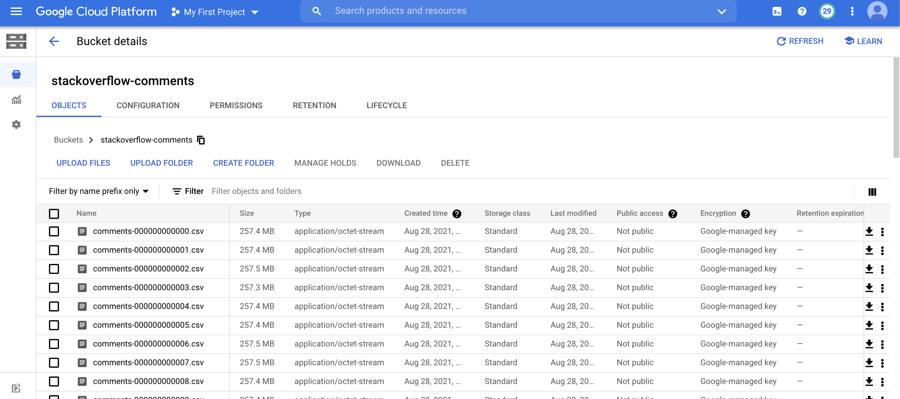

# Домашнее задание
### Работа с индексами, join'ами, статистикой

### Цель:
- знать и уметь применять основные виды индексов PostgreSQL
- строить и анализировать план выполнения запроса
- уметь оптимизировать запросы для с использованием индексов
- знать и уметь применять различные виды join'ов
- строить и анализировать план выполенения запроса
- оптимизировать запрос
- уметь собирать и анализировать статистику для таблицы

##### Выбрал первый вариант, т.к. с джойнами работаю чаще :)
### 1 вариант: Создать индексы на БД, которые ускорят доступ к данным. В данном задании тренируются навыки:
 - определения узких мест 
 - написания запросов для создания индекса оптимизации
#####Необходимо:
- Создать индекс к какой-либо из таблиц вашей БД
- Прислать текстом результат команды explain, в которой используется данный индекс
- Реализовать индекс для полнотекстового поиска
- Реализовать индекс на часть таблицы или индекс на поле с функцией
- Создать индекс на несколько полей
- Написать комментарии к каждому из индексов
- Описать что и как делали и с какими проблемами столкнулись

> Создал новую базу из выгрузки для прошлой домашки

> Выгрузил данные через GCS
> overflow-stack-comment/*.csv

> > Создал ВМ с SSD на 50ГБ с 1 ЦПУ и 4 гб оперативной памяти
>
> Загрузил файлы через gsutil файлы на ВМ
>
> gsutil -m cp -R gs://stackoverflow-comments /tmp/stackoverflow/
>
> Создал таблицу для загрузки данных

```postgresql
create table comments (id INTEGER,
text	 VARCHAR,
creation_date TIMESTAMP,	
post_id INTEGER,
user_id INTEGER,
user_display_name VARCHAR(100),
score INTEGER);
```

> Включил отслеживание времени выполнения команд \
> \timing \

### Создание простого индекса 

> Сделал запрос на получение post_id, user_id, score, где score > 5 \ 
> такой запрос мог бы быть полезен в аналитике комментариев\
> Без индекса запрос выполнялся \

```postgresql
postgres=# select user_id,post_id,score from comments where score > 5;
Time: 3719.871 ms (00:03.720) 
```
> План запроса был следующим 
```postgresql
postgres=# explain select user_id,post_id,score from comments where score > 5;
                                   QUERY PLAN                                    
---------------------------------------------------------------------------------
 Gather  (cost=1000.00..456352.62 rows=114619 width=12)
   Workers Planned: 2
   ->  Parallel Seq Scan on comments  (cost=0.00..443890.72 rows=47758 width=12)
         Filter: (score > 5)
 JIT:
   Functions: 4
   Options: Inlining false, Optimization false, Expressions true, Deforming true
(7 rows)

Time: 1.304 ms
postgres=# select user_id,post_id,score from comments where score > 5;
Time: 3719.871 ms (00:03.720)
```
```postgresql

postgres=# explain analyze select user_id,post_id,score from comments where score > 5;
                                                              QUERY PLAN                                                              
--------------------------------------------------------------------------------------------------------------------------------------
 Gather  (cost=1000.00..456352.62 rows=114619 width=12) (actual time=8.964..51981.940 rows=105502 loops=1)
   Workers Planned: 2
   Workers Launched: 2
   ->  Parallel Seq Scan on comments  (cost=0.00..443890.72 rows=47758 width=12) (actual time=1194.232..51911.909 rows=35167 loops=3)
         Filter: (score > 5)
         Rows Removed by Filter: 4547990
 Planning Time: 0.077 ms
 JIT:
   Functions: 12
   Options: Inlining false, Optimization false, Expressions true, Deforming true
   Timing: Generation 4.161 ms, Inlining 0.000 ms, Optimization 2.260 ms, Emission 25.517 ms, Total 31.938 ms
 Execution Time: 51988.786 ms
(12 rows)

Time: 51989.496 ms (00:51.989)
```
>Как можно увидеть из планировщика - запрос осуществлялся при помощи построения плана по сканированию сиквенса

> А теперь при помощи индекса по полю score - создаю индекс по этому полю, т.к. это поле полезно при сборе статистике по ответам
```postgresql
postgres=# create index on comments (score );
CREATE INDEX
Time: 51473.920 ms (00:51.474)
```
> информация о таблице выглядит теперь следующим образом:
```postgresql
postgres=# \d comments
                             Table "public.comments"
      Column       |            Type             | Collation | Nullable | Default 
-------------------+-----------------------------+-----------+----------+---------
 id                | integer                     |           |          | 
 text              | character varying           |           |          | 
 creation_date     | timestamp without time zone |           |          | 
 post_id           | integer                     |           |          | 
 user_id           | integer                     |           |          | 
 user_display_name | character varying(100)      |           |          | 
 score             | integer                     |           |          | 
Indexes:
    "comments_score_idx" btree (score)

postgres=#
```
> Создался индекс с названием comments_score_idx \
> Выборка данных по такому же фильтру заняла
```postgresql
postgres=#  select user_id,post_id,score from comments where score > 5;
Time: 111.880 ms
```
> разница ощутимая 112 мс против 3720 мс
> Можно увидеть отличие в построении плана запроса
```postgresql
postgres=# explain select user_id,post_id,score from comments where score > 5;
                                          QUERY PLAN                                          
----------------------------------------------------------------------------------------------
 Index Scan using comments_score_idx on comments  (cost=0.43..190428.69 rows=113491 width=12)
   Index Cond: (score > 5)
 JIT:
   Functions: 4
   Options: Inlining false, Optimization false, Expressions true, Deforming true
(5 rows)

Time: 1.503 ms
```

> Как я понимаю, выборка данных будет осуществлять сугубо на значении из индекса

### Создание индекса для полнотекстового поиска
> Для такого индекса лучше всего нам подойдет колонка text, так как там записано тело комментария, которое оставлял пользователь
> Выбирать данные без индекса боюсь, т.к. всего записей почти 14 млн
```postgresql
postgres=# select count(*) from comments ;
  count   
----------
 13749471
(1 row)

Time: 1030.694 ms (00:01.031)
postgres=# 
```
> Реализуем индекс, после чего попробуем сделать выборку
> будем искать значение, которое возьмем из BigQuery
 - id = 118261984
> Для этого нам потребуется создать новую колонку в таблице с типом tsvector и записать туда значения
```postgresql
postgres=# alter table comments add column lexeme_text tsvector;
ALTER TABLE
Time: 4.571 ms
postgres=# update comments set lexeme_text = to_tsvector(text);
UPDATE 13749471
Time: 861990.913 ms (14:21.991)
postgres=# create index lexeme_find_text on comments using GIN (lexeme_text);
CREATE INDEX
Time: 543286.904 ms (09:03.287)
```
> Попробуем сделать поиск
```postgresql
postgres=# select * from comments where lexeme_text @@ plainto_tsquery('i am new in js, when i am trying to debug by console.log(addForm.value)');
Time: 1.250 ms
    id     
-----------
 118261984
(1 row)

Time: 0.981 ms
```
>План запроса
```postgresql
postgres=# explain select * from comments where lexeme_text @@ plainto_tsquery('i am new in js, when i am trying to debug by console.log(addForm.value)');
                                                              QUERY PLAN                                                               
---------------------------------------------------------------------------------------------------------------------------------------
 Bitmap Heap Scan on comments  (cost=124.25..128.51 rows=1 width=387)
   Recheck Cond: (lexeme_text @@ plainto_tsquery('i am new in js, when i am trying to debug by console.log(addForm.value)'::text))
   ->  Bitmap Index Scan on lexeme_find_text  (cost=0.00..124.25 rows=1 width=0)
         Index Cond: (lexeme_text @@ plainto_tsquery('i am new in js, when i am trying to debug by console.log(addForm.value)'::text))
(4 rows)

Time: 1.921 ms
```
> Создали индекс на часть таблицы
```postgresql
postgres=# create index post_range_idx on comments(post_id)  where post_id > 10000000 and post_id < 13995944 ;
CREATE INDEX
Time: 286270.063 ms (04:46.270)
postgres=# \d comments
                             Table "public.comments"
      Column       |            Type             | Collation | Nullable | Default 
-------------------+-----------------------------+-----------+----------+---------
 id                | integer                     |           |          | 
 text              | character varying           |           |          | 
 creation_date     | timestamp without time zone |           |          | 
 post_id           | integer                     |           |          | 
 user_id           | integer                     |           |          | 
 user_display_name | character varying(100)      |           |          | 
 score             | integer                     |           |          | 
 lexeme_text       | tsvector                    |           |          | 
Indexes:
    "comments_score_idx" btree (score)
    "lexeme_find_text" gin (lexeme_text)
    "post_range_idx" btree (post_id) WHERE post_id > 10000000 AND post_id < 13995944
```
> Выборка значения, где post_id попадает под индекс
```postgresql
postgres=# select text from comments where post_id = 12374442;
    text     
-------------
 Lorem Ipsum
(1 row)

Time: 0.385 ms
postgres=# select text, lexe from comments where post_id = 12374442;

postgres=# select text, lexeme_text  from comments where post_id = 12374442;
    text     |     lexeme_text     
-------------+---------------------
 Lorem Ipsum | 'ipsum':2 'lorem':1
(1 row)

Time: 0.404 ms
postgres=# explain select text, lexeme_text  from comments where post_id = 12374442;
QUERY PLAN                                    
----------------------------------------------------------------------------------
 Index Scan using post_range_idx on comments  (cost=0.29..40.26 rows=9 width=352)
   Index Cond: (post_id = 12374442)
(2 rows)

Time: 0.793 ms
```
> Запрос значения не из индекса 
```postgresql
postgres=# select text, lexeme_text from comments where post_id = 66906787;
Time: 286352.269 ms (04:46.352)
postgres=# 
```
### Создание индекса по нескольким колонкам
> Создадим индекс по user_id и text, чтобы при поиске по user_id могли сразу получить тело комментария созданные этим пользователем
> Пример выполнения запроса поиска
```postgresql
postgres=# select * from comments where user_id is null and text = 'You are right, works, thanks';
    id     |             text             |      creation_date      | post_id  | user_id | user_display_name | score |         lexeme_text          
-----------+------------------------------+-------------------------+----------+---------+-------------------+-------+------------------------------
 118055584 | You are right, works, thanks | 2021-03-24 16:07:47.413 | 66784757 |         | user15296624      |     0 | 'right':3 'thank':5 'work':4
(1 row)

Time: 6.706 ms
postgres=# explain select * from comments where user_id is null and text = 'You are right, works, thanks';
                                         QUERY PLAN                                          
---------------------------------------------------------------------------------------------
 Index Scan using comments_user_id_text_idx on comments  (cost=0.81..8.83 rows=1 width=387)
   Index Cond: ((user_id IS NULL) AND ((text)::text = 'You are right, works, thanks'::text))
(2 rows)

Time: 0.535 ms
```
> Как видно по плану запроса - запрос был реализован только при помощи комбинированного индекса
