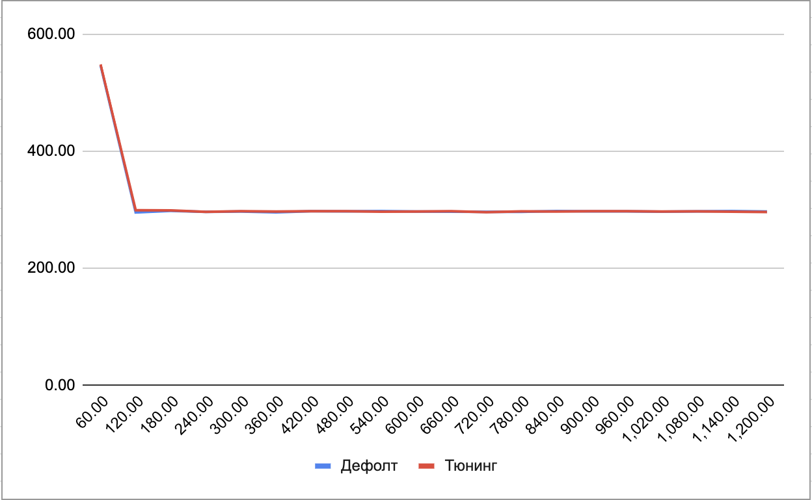

# Домашнее задание

### Настройка autovacuum с учетом оптимальной производительности

###Цель:
- запустить нагрузочный тест pgbench с профилем нагрузки DWH
- настроить параметры autovacuum для достижения максимального уровня устойчивой производительности
- создать GCE инстанс типа e2-medium и standard disk 10GB
- установить на него PostgreSQL 13 с дефолтными настройками
- применить параметры настройки PostgreSQL из прикрепленного к материалам занятия файла
- выполнить pgbench -i postgres
- запустить pgbench -c8 -P 60 -T 3600 -U postgres postgres
- дать отработать до конца
- зафиксировать среднее значение tps в последней ⅙ части работы
- а дальше настроить autovacuum максимально эффективно
- так чтобы получить максимально ровное значение tps на горизонте часа

> Установим postgresql на ВМ и укажем дополнительные настройки
max_connections = 40 \
shared_buffers = 1GB \
effective_cache_size = 3GB \
maintenance_work_mem = 512MB \
checkpoint_completion_target = 0.9 \
wal_buffers = 16MB \
default_statistics_target = 500 \
random_page_cost = 4 \
effective_io_concurrency = 2 \
work_mem = 6553kB \
min_wal_size = 4GB \
max_wal_size = 16GB \

> Обновим настройки и проведем первое тестирование 
```
postgres@autovacuum-instance:/home/andrey$ pgbench -i postgres
dropping old tables...
creating tables...
generating data (client-side)...
100000 of 100000 tuples (100%) done (elapsed 0.09 s, remaining 0.00 s)
vacuuming...
creating primary keys...
done in 0.38 s (drop tables 0.01 s, create tables 0.01 s, client-side generate 0.21 s, vacuum 0.08 s, primary keys 0.07 s).
postgres@autovacuum-instance:/home/andrey$ pgbench -c8 -P 60 -T 1200 -U postgres postgres

```
##### Результат 
> postgres@autovacuum-instance:/home/andrey$ pgbench -c8 -P 60 -T 1200 -U postgres postgres \
> starting vacuum...end.

| Seconds | Tps   | Lat, ms | stddev |
|---------|-------|---------|--------|
| 60.0    | 546.0 | 14.643  | 12.472 |
| 120.0   | 295.3 | 27.089  | 13.888 |
| 180.0   | 297.9 | 26.857  | 12.705 |
| 240.0   | 296.4 | 26.990  | 13.254 |
| 300.0   | 296.9 | 26.948  | 13.287 |
| 360.0   | 295.4 | 27.076  | 13.767 |
| 420.0   | 297.4 | 26.897  | 12.617 |
| 480.0   | 297.1 | 26.928  | 13.239 |
| 540.0   | 297.7 | 26.872  | 12.511 |
| 600.0   | 296.9 | 26.939  | 13.337 |
| 660.0   | 296.5 | 26.987  | 13.675 |
| 720.0   | 296.4 | 26.986  | 13.785 |
| 780.0   | 296.4 | 26.988  | 13.459 |
| 840.0   | 297.7 | 26.872  | 13.282 |
| 900.0   | 297.2 | 26.920  | 13.484 |
| 960.0   | 297.3 | 26.904  | 12.941 |

> transaction type: <builtin: TPC-B (sort of)> \
> scaling factor: 1 \ 
> query mode: simple \
> number of clients: 8 \
> number of threads: 1 \
> duration: 1200 s \
> number of transactions actually processed: 371201 \
> latency average = 25.861 ms \
> latency stddev = 13.759 ms \
> tps = 309.327432 (including connections establishing) \
> tps = 309.328155 (excluding connections establishing)


### Тюнинг autovacuum'а
```
#------------------------------------------------------------------------------
# AUTOVACUUM
#------------------------------------------------------------------------------

#autovacuum = on			# Enable autovacuum subprocess?  'on'
					# requires track_counts to also be on.
log_autovacuum_min_duration = 0		# -1 disables, 0 logs all actions and
					# their durations, > 0 logs only
					# actions running at least this number
					# of milliseconds.
autovacuum_max_workers = 8		# max number of autovacuum subprocesses
					# (change requires restart)
autovacuum_naptime = 15s		# time between autovacuum runs
autovacuum_vacuum_threshold = 25	# min number of row updates before
					# vacuum
#autovacuum_vacuum_insert_threshold = 1000	# min number of row inserts
					# before vacuum; -1 disables insert
					# vacuums
#autovacuum_analyze_threshold = 25	# min number of row updates before
					# analyze
autovacuum_vacuum_scale_factor = 0.1	# fraction of table size before vacuum
#autovacuum_vacuum_insert_scale_factor = 0.2	# fraction of inserts over table
					# size before insert vacuum
#autovacuum_analyze_scale_factor = 0.1	# fraction of table size before analyze
#autovacuum_freeze_max_age = 200000000	# maximum XID age before forced vacuum
					# (change requires restart)
#autovacuum_multixact_freeze_max_age = 400000000	# maximum multixact age
					# before forced vacuum
					# (change requires restart)
autovacuum_vacuum_cost_delay = 10ms	# default vacuum cost delay for
					# autovacuum, in milliseconds;
						# -1 means use vacuum_cost_delay
autovacuum_vacuum_cost_limit = 1000	# default vacuum cost limit for
					# autovacuum, -1 means use
					# vacuum_cost_limit


#------------------------------------------------------------------------------
```

> Включил запись логов об исполнении каждого vacuum'а \
> Увеличил количество возможных подпроцессов до 10 \ 
> Установил промежутки запусков процесса autovacuum'а в 15 секунд \
> Минимальное количество измененных строк для старта процесса autovacuum'a выставил в 25 \
> Процент измененых строк в таблице поставил 0,1, то есть 10% (решил сделать так, потому что после первых тестовых проверил объем данных и они весьма малы) \
> Изменил параметр задержки в мс при превышении лимита стоимости  и указал сам предел стоимости = 1000


> Запустим повторный тест нагрузки
> postgres@autovacuum-instance:/home/andrey$ pgbench -c8 -P 60 -T 1200 -U postgres postgres \
> starting vacuum...end. \

| Progress, s | Tps   | Lat. ms | stddev |
|-------------|-------|---------|--------|
| 60.0        | 547.9 | 14.592  | 13.331 |
| 120.0       | 299.1 | 26.747  | 12.893 |
| 180.0       | 298.9 | 26.764  | 12.368 |
| 240.0       | 296.3 | 26.998  | 13.419 |
| 300.0       | 297.5 | 26.892  | 12.768 |
| 360.0       | 296.9 | 26.946  | 13.109 |
| 420.0       | 297.4 | 26.898  | 13.683 |
| 480.0       | 297.6 | 26.877  | 14.018 |
| 540.0       | 296.5 | 26.982  | 13.546 |
| 600.0       | 296.8 | 26.959  | 14.077 |
| 660.0       | 297.5 | 26.887  | 13.608 |
| 720.0       | 295.9 | 27.031  | 14.380 |
| 780.0       | 297.2 | 26.924  | 13.908 |
| 840.0       | 296.8 | 26.953  | 14.338 |
| 900.0       | 297.5 | 26.887  | 13.972 |
| 960.0       | 297.5 | 26.893  | 13.117 |
| 1020.0      | 296.8 | 26.953  | 12.696 |
| 1080.0      | 297.3 | 26.894  | 13.310 |
| 1140.0      | 296.7 | 26.970  | 12.650 |
| 1200.0      | 296.0 | 27.029  | 14.188 |

> transaction type: <builtin: TPC-B (sort of)> \
> scaling factor: 1 \
> query mode: simple \
> number of clients: 8 \
> number of threads: 1 \ 
> duration: 1200 s \
> number of transactions actually processed: 371648 \
> latency average = 25.830 ms \
> latency stddev = 13.922 ms \
> tps = 309.700581 (including connections establishing) \
> tps = 309.701259 (excluding connections establishing) \


