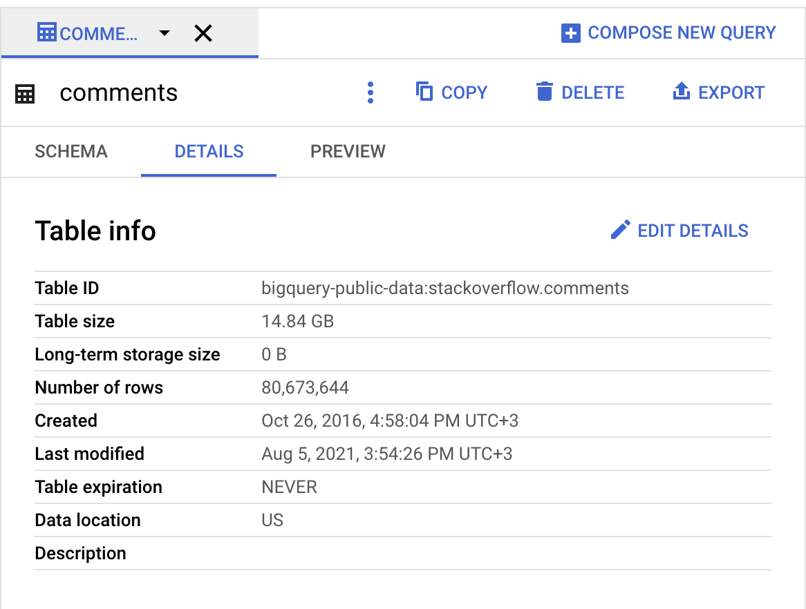
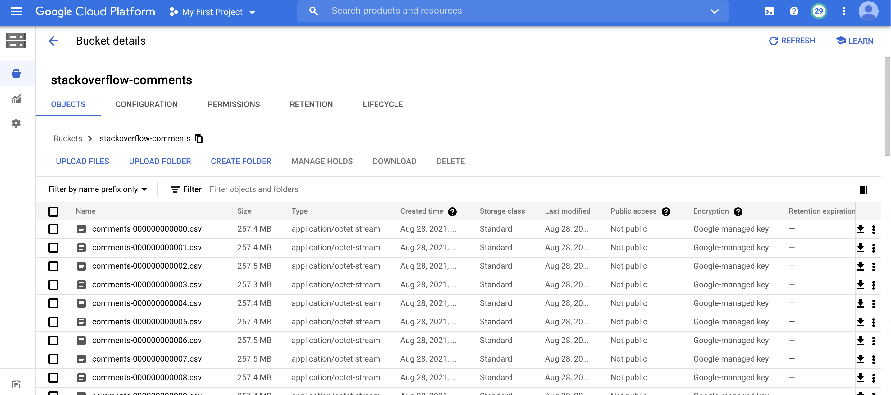

#Домашнее задание

### Разворачиваем и настраиваем БД с большими данными

### Цель:
- знать различные механизмы загрузки данных
- уметь пользоваться различными механизмами загрузки данных

### Задание:
- Необходимо провести сравнение скорости работы запросов на различных СУБД
- Выбрать одну из СУБД
- Загрузить в неё данные (10 Гб)
- Сравнить скорость выполнения запросов на PosgreSQL и выбранной СУБД
- Описать что и как делали и с какими проблемами столкнулись


##### Для работы была выбрана таблица с данными stackoverflow.comments


> Выгрузил данные через GCS
> stackoverflow-comments/comments-*.csv



> Создал ВМ с SSD на 50ГБ с 1 ЦПУ и 4 гб оперативной памяти
> 
> Загрузил файлы через gsutil файлы на ВМ
> 
> gsutil -m cp -R gs://stackoverflow-comments /tmp/stackoverflow/
> 
> Создал таблицу для загрузки данных

```postgresql
create table comments (id INTEGER,
text	 VARCHAR,
creation_date TIMESTAMP,	
post_id INTEGER,
user_id INTEGER,
user_display_name VARCHAR(100),
score VARCHAR(10));
```

> Включил отслеживание времени выполнения команд
> \timing
 
> Залил данные в СУБД 
```postgresql
postgres=# copy comments(id,text,creation_date,post_id,user_id,user_display_name,score) from program 'awk FNR-1 /tmp/stackoverflow/stackoverflow-comments/comments-*.csv | cat' DELIMITER ',' CSV HEADER;

COPY 80673643
Time: 1279860.346 ms (21:19.860)
```

> Сделал одинаковую выборку на BigQuery и в postgresql
> Результат postgres
```postgresql
postgres=# select count(*) from comments  where score is not null;
  count   
----------
 80673643
(1 row)

Time: 994699.756 ms (16:34.700)
```
>Результат BigQuery


>  Разница выполнения запроса более чем очевидна
> Никаких особо проблем не испытал при выполнении домашки, только приходилось ждать результата исполнения :)
