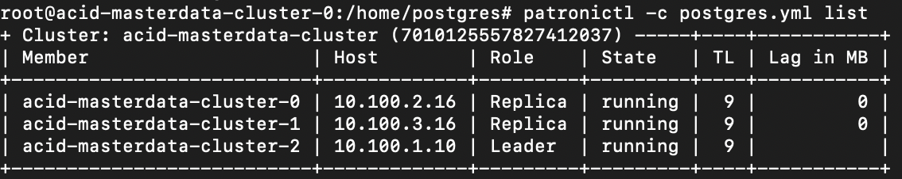
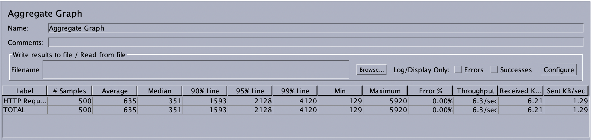

# Приложение полнотекстового поиска по мастер данным на базе HA кластера Patroni

### Идея. Создать кластер высокой доступности для работы с большими данными

### Основные компопненты

##### В проектной работе использовались:

- Данные из GCS - таблица chicago_taxi_trips. Размер таблицы ≈ 72 ГБ и ≈ 200 млн строк


- GKE - для развертывания кластера Patroni
> 4 Ноды по 4 CPU 8GB
- [Zalando/postgres-operator](https://github.com/zalando/postgres-operator)
- [Бэкенд на nodejs для тестирования запросов](https://github.com/Rosenrot48/bobrov-andrey-otus/tree/postgresql/postgresql/project)  
- [jMeter для тестирования доступности системы](https://jmeter.apache.org/)

### Настройка доступа

Для работы с базой taxi_trips в кластере был создан пользователь taxi_back и выданы права для работы с базой

### Архитектура таблицы


> Были созданы:
> - дополнительный атрибут lexeme_company tsvector для возможности создания полнотекстового поиска
> - индекс по этому атрибуту с использованием метода индексирования GIN
> - индекс по fare
> - секционирование таблицы по дате поездки

### Первоначальная загрузка данных

> Для загрузки данных использовалась дополнительная ВМ и gsutil \
> Весь процесс загрузки с индексами занял около часа \
> После загрузки обновил данные в колонке lexeme_company

**Рекомендации** \
[Необходимо следить за состоянием wal файлов и настройть логику архивирования](https://www.postgresql.org/docs/13/pgarchivecleanup.html)

### Работа кластера


### Кластер состоит из:
> - deployment необходимый для приложения
> - statefulset для кластера Patroni и все необходимые сервисы и деплоименты

**Доступ к базе извне** 
> Для получения доступа к базе снаружи пода необходимо:
> - создать кластер с первичными настройками
> - зайти на любой под и скопировать блок из postgres.yml относящийся к pg_hba
> - добавить эту информацию в [Манифест кластера](cluster.yaml)
> - указать дополнительное условие подключения
> - применить манифест для изменения настроек на всех подах

**Кластер патрони**



```
cat postgres.yml 
bootstrap:
  dcs:
    loop_wait: 10
    maximum_lag_on_failover: 33554432
    postgresql:
      parameters:
        archive_mode: 'on'
        archive_timeout: 1800s
        autovacuum_analyze_scale_factor: 0.02
        autovacuum_max_workers: 5
        autovacuum_vacuum_scale_factor: 0.05
        checkpoint_completion_target: 0.9
        hot_standby: 'on'
        log_autovacuum_min_duration: 0
        log_checkpoints: 'on'
        log_connections: 'on'
        log_disconnections: 'on'
        log_line_prefix: '%t [%p]: [%l-1] %c %x %d %u %a %h '
        log_lock_waits: 'on'
        log_min_duration_statement: 500
        log_statement: ddl
        log_temp_files: 0
        max_connections: 133
        max_replication_slots: 10
        max_wal_senders: 10
        tcp_keepalives_idle: 900
        tcp_keepalives_interval: 100
        track_functions: all
        wal_level: hot_standby
        wal_log_hints: 'on'
      use_pg_rewind: true
      use_slots: true
    retry_timeout: 10
    ttl: 30
  initdb:
  - auth-host: md5
  - auth-local: trust
  post_init: /scripts/post_init.sh "zalandos"
  users:
    zalandos:
      options:
      - CREATEDB
      - NOLOGIN
      password: ''
kubernetes:
  bypass_api_service: true
  labels:
    application: spilo
  pod_ip: 10.100.2.16
  ports:
  - name: postgresql
    port: 5432
  role_label: spilo-role
  scope_label: cluster-name
  use_endpoints: true
postgresql:
  authentication:
    replication:
      password: RwWgYBVvCTuEsxMEv1EJqTxcucTE3nVXPuBCoCMSdQ9JCixZwjdYfSXugthHRFdk
      username: standby
    superuser:
      password: 6YLrWm1lEOf7eigcxjqcUKRgm8jpm1EpS1fEJ5LQDQoaDK3tpO0yC00Hq8OvrtNO
      username: postgres
  basebackup_fast_xlog:
    command: /scripts/basebackup.sh
    retries: 2
  bin_dir: /usr/lib/postgresql/13/bin
  callbacks:
    on_role_change: /scripts/on_role_change.sh zalandos true
  connect_address: 10.100.2.16:5432
  create_replica_method:
  - basebackup_fast_xlog
  data_dir: /home/postgres/pgdata/pgroot/data
  listen: '*:5432'
  name: acid-masterdata-cluster-0
  parameters:
    archive_command: /bin/true
    bg_mon.history_buckets: 120
    bg_mon.listen_address: '::'
    extwlist.custom_path: /scripts
    extwlist.extensions: btree_gin,btree_gist,citext,hstore,intarray,ltree,pgcrypto,pgq,pg_trgm,postgres_fdw,tablefunc,uuid-ossp,hypopg,timescaledb,pg_partman
    log_destination: csvlog
    log_directory: ../pg_log
    log_file_mode: '0644'
    log_filename: postgresql-%u.log
    log_rotation_age: 1d
    log_truncate_on_rotation: 'on'
    logging_collector: 'on'
    pg_stat_statements.track_utility: 'off'
    shared_buffers: 800MB
    shared_preload_libraries: bg_mon,pg_stat_statements,pgextwlist,pg_auth_mon,set_user,timescaledb,pg_cron,pg_stat_kcache
    ssl: 'on'
    ssl_cert_file: /run/certs/server.crt
    ssl_key_file: /run/certs/server.key
  pg_hba:
  - local   all             all                                   trust
  - hostssl all             +zalandos    127.0.0.1/32       pam
  - host    all             all                127.0.0.1/32       md5
  - hostssl all             +zalandos    ::1/128            pam
  - host    all             all                ::1/128            md5
  - local   replication     standby                    trust
  - hostssl replication     standby all                md5
  - hostssl all             +zalandos    all                pam
  - hostssl all             all                all                md5
  - local all all trust
  - host replication standby all md5
  - host taxi_trips taxi_back 0.0.0.0/0 md5
  pgpass: /run/postgresql/pgpass
  use_unix_socket: true
  use_unix_socket_repl: true
restapi:
  connect_address: 10.100.2.16:8008
  listen: :8008
scope: acid-masterdata-cluster

```

### Бэкенд для тестирования
> Для тестирования был реализован самый простой бэкенд, \
> написанный на Node.js с использованием библиотеки pg-promise \
> Приложение развернуто как deployment в том же кластере \
> Данные для подключения вынесены в конфигурационный файл deployment'а


### Тестрование доступности кластера
> Для тестирования кластера был использован jMeter \
> Будет выполнено 3 запроса 50 конкурентных пользователями 10 раз

> **Запросы**
> - по стоимости поездки (fare) = 570 и дате начала поездки = 2013-01-08T13:15:00.000Z \
> Happy path



> Failover


> - по названию компании (lexeme_company) = KOAM Taxi Association \
> Happy path


> Failover


> - с limit в 1000 и offset 400  \
> Happy path


> Failover


> 
> При одновременной работе трех запросов у самого ресурсоемкого были проблемы с производительностью. \
> в 2% случаев (предполагаю, что это связано с нестабильности моей сети, т.к. на сервере нет логов о неудачном запросе) 
> 
> **Примечание** 
> 
> Бэкенд накладывает ограничение в 20 элементов и offset 0, если не указано другого в строке запроса 

> При тестировании были рассмотрены два варианта работы:
> - в штатном режиме 
> [](https://youtu.be/-2owP90LNoI) 
> в штатном режиме все запросы имели хорошие показатели, кроме самого ресурсоемкого, у которого было 2% ошибок, связанных, по ощущению с сетью
> - при падении ноды реплики
> [](https://youtu.be/hFniKQjjwfg)
> при падении лидера и создании нового лидира запросы имели примерно такие же показатели. \
> самый "легкий" запрос выполнялся и дальше без ошибок \
> средний имел примерно 1% ошибок \
> самый тяжелый имел примерно 6% ошибок
>
> **Примечание** \
> Процесс тестирования будет в отдельном демо


